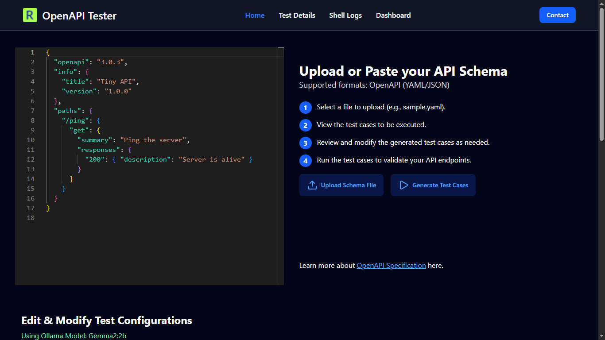

# OpenAPI Testing Tool

Automatically generate comprehensive API test cases from your OpenAPI specification using a local Ollama model. This tool simplifies API validation, reduces manual effort, and integrates seamlessly into your development workflow.

For learning more about OpenAPI Specifications: https://spec.openapis.org/oas/v3.1.0.html#openapi-specification

## ✨ Features

- **OpenAPI Integration** - Parses your API specification to understand endpoints and schemas
- **Local Ollama Model** - Uses a locally hosted LLM for generating intelligent test cases
- **Automated Test Generation** - Quickly produces unit/integration tests for endpoints
- **User Friendly Interface** - Clean, intuitive UI for seamless interaction
- **Fast & Secure** - No external API calls; all processing happens locally
- **Multiple Export Formats** - Generate tests in various formats (Jest, Mocha, etc.)
- **Schema Validation** - Automatically validates request/response schemas

## 📋 Prerequisites

- Node.js `v22.12.0` or higher (Important)
- npm or yarn
- Ollama installed locally (https://ollama.com/download)
- Your OpenAPI specification file (`openapi.yaml` or `.json`)

## 🛠 Installation Steps

### 1. Clone the Repository

```shell
git clone git@github.com:eddyseed/OpenAPI-Testing-Tool.git
cd OpenAPI-Testing-Tool/
```

### 2. Install Dependencies

Install dependencies for both frontend and backend:

```shell
# Install backend dependencies
cd backend
npm install

# Install frontend dependencies
cd ../frontend
npm install
```

### 3. Verify Ollama Installation

```shell
ollama list
```

Ensure your desired model (e.g., `phi3:mini`) is available. If not, pull a model:

```shell
ollama pull phi3:mini
```

Recommended models:
- `phi3:mini` - Lightweight and fast
- `llama2` - More comprehensive
- `codellama` - Optimized for code generation

### 4. Configure Environment Variables

Copy the sample environment file and configure it:

```shell
cd backend
cp .env.sample .env
```

Edit your `.env` file:

```env
# Server Configuration
PORT=3000
NODE_ENV=development 

# URLs
LOCAL_HOST=http://localhost:3000
CORS_ORIGIN=http://localhost:5173

# Ollama Configuration
OLLAMA_HOST=http://localhost:11434

# Set your own local model name (from ollama list)
MODEL_NAME=phi3:mini
```

> **Note:** Run `ollama list` to see available models and update `MODEL_NAME` accordingly.

## 🚀 Running the Application

### Start the Backend Server

```shell
cd backend
npm run dev
```

The backend will start on `http://localhost:3000`

### Start the Frontend Development Server

In a new terminal:

```shell
cd frontend
npm run dev
```

The frontend will start on `http://localhost:5173`

### Access the Application

Open your browser and navigate to: `http://localhost:5173`

## 📖 Usage Guide

### 1. Upload OpenAPI Specification

- Click the upload button to upload your OpenAPI file (`.yaml` or `.json`)
- The tool will parse and display your API endpoints

### 2. Select Endpoints

- Browse through the parsed endpoints 
### 3. Generate Tests

- Click "Generate Tests" button
- The AI model will analyze your API specification
- Wait for the generation process to complete

### 4. Review and Export

- Review the generated test cases

## 🧪 Example OpenAPI Specification

Here's a minimal example to get started:

```yaml
openapi: 3.0.0
info:
  title: Sample API
  version: 1.0.0
paths:
  /users:
    get:
      summary: Get all users
      responses:
        '200':
          description: Successful response
          content:
            application/json:
              schema:
                type: array
                items:
                  type: object
                  properties:
                    id:
                      type: integer
                    name:
                      type: string
                    email:
                      type: string
    post:
      summary: Create a new user
      requestBody:
        required: true
        content:
          application/json:
            schema:
              type: object
              properties:
                name:
                  type: string
                email:
                  type: string
      responses:
        '201':
          description: User created successfully
        '400':
          description: Bad request
```

## 🎨 Screenshots

### Main Dashboard

*Upload your OpenAPI specification to get started*

### Endpoint Selection

*Browse and select endpoints for test generation*

### Test Generation

*AI-powered test case generation in progress*

### Generated Tests

*Review, edit, and export your test cases*

## 🔧 Configuration Options

<!-- ### Supported Test Frameworks

- **Jest** - Modern JavaScript testing framework
- **Mocha** - Flexible testing framework with rich features
- **Jasmine** - Behavior-driven development framework
- **Supertest** - HTTP assertion library for API testing
- **Vitest** - Next-generation testing framework -->

### Test Coverage Levels

- **Basic** - Essential happy path tests only
- **Standard** - Common scenarios and edge cases
- **Comprehensive** - Full coverage including error scenarios, validation, and boundary conditions

<!-- ### Customization

Modify test templates in `backend/templates/` to customize output format and structure according to your team's standards. -->

## 🐛 Troubleshooting

### Common Issues

**Ollama Connection Error**
```
Error: connect ECONNREFUSED 127.0.0.1:11434
```
**Solution:** Ensure Ollama is running: `ollama serve`

**Model Not Found**
```
Error: model 'phi3:mini' not found
```
**Solution:** Pull the model: `ollama pull phi3:mini`

**Port Already in Use**
```
Error: listen EADDRINUSE: address already in use :::3000
```
**Solution:** Change the `PORT` in `.env` or kill the process using the port:
```shell
# Find process using port 3000
lsof -i :3000
# Kill the process
kill -9 <PID>
```

**CORS Errors**
```
Access to XMLHttpRequest has been blocked by CORS policy
```
**Solution:** Verify `CORS_ORIGIN` in `.env` matches your frontend URL exactly

**OpenAPI Parse Error**
```
Error: Invalid OpenAPI specification
```
**Solution:** Validate your OpenAPI file using online validators like https://editor.swagger.io/

**Node Version Mismatch**
```
Error: The engine "node" is incompatible
```
**Solution:** Ensure you're using Node.js v22.12.0 or higher:
```shell
node --version
```

## 🤝 Contributing

Contributions are welcome! Please follow these steps:

1. Fork the repository
2. Create a feature branch: `git checkout -b feature/amazing-feature`
3. Commit your changes: `git commit -m 'Add amazing feature'`
4. Push to the branch: `git push origin feature/amazing-feature`
5. Open a Pull Request

### Development Guidelines

- Follow the existing code style and conventions
- Write meaningful commit messages following conventional commits
- Add tests for new features
- Update documentation as needed
- Ensure all tests pass before submitting PR
- Keep pull requests focused on a single feature or fix

### Code Style

- Use ESLint for JavaScript linting
- Follow Airbnb JavaScript style guide
- Use Prettier for code formatting
- Write descriptive variable and function names

## 📝 License

This project is licensed under no license - see the [LICENSE](LICENSE) file for details.

## 🙏 Acknowledgments

- [OpenAPI Initiative](https://www.openapis.org/) for the specification standard
- [Ollama](https://ollama.com/) for local LLM hosting
- [React](https://react.dev/) for the frontend framework
- [Express.js](https://expressjs.com/) for the backend framework
- All contributors and users of this tool

## 📞 Support

- **Issues:** [GitHub Issues](https://github.com/eddyseed/OpenAPI-Testing-Tool/issues)
- **Discussions:** [GitHub Discussions](https://github.com/eddyseed/OpenAPI-Testing-Tool/discussions)
- **Documentation:** [Wiki](https://github.com/eddyseed/OpenAPI-Testing-Tool/wiki)
- **Email:** support@example.com (update with actual contact)

## 🗺 Roadmap

### Short Term (Q1 2025)
- [ ] Support for GraphQL schemas
- [ ] Integration with CI/CD pipelines
- [ ] Docker containerization

### Medium Term (Q2-Q3 2025)
- [ ] Multi-language test generation (Python, Java, Go)
- [ ] Performance testing capabilities
- [ ] Mock server generation
- [ ] API documentation generation

### Long Term (Q4 2025 and beyond)
- [ ] Cloud deployment options
- [ ] Team collaboration features
- [ ] Test execution and reporting
- [ ] Integration with API gateways

## ⚡ Performance Tips

1. **Use lightweight models** for faster generation (e.g., `phi3:mini`)
2. **Generate tests in batches** for large specifications
3. **Cache frequently used specifications** to avoid re-parsing
4. **Allocate sufficient RAM** to Ollama (8GB+ recommended)
5. **Use SSD storage** for faster model loading
6. **Limit concurrent generations** to avoid resource exhaustion

## 🔒 Security Considerations

- All processing happens locally - no data leaves your machine
- No external API calls to third-party services
- Review generated tests before deployment
- Keep dependencies updated for security patches
- Use environment variables for sensitive configuration

## 💡 Best Practices

1. **Always validate your OpenAPI spec** before uploading
2. **Start with basic coverage** and gradually increase
3. **Review generated tests** for accuracy and completeness
4. **Customize templates** to match your team's standards
5. **Keep your Ollama models updated** for best results
6. **Use version control** for your test files
7. **Integrate with CI/CD** for automated testing

## 🎓 Learning Resources

- [OpenAPI Specification Guide](https://spec.openapis.org/oas/v3.1.0.html)
- [Ollama Documentation](https://github.com/ollama/ollama/blob/main/docs/README.md)
- [API Testing Best Practices](https://www.postman.com/api-testing-best-practices/)
- [Test Automation Patterns](https://martinfowler.com/articles/practical-test-pyramid.html)

---

**Made with ❤️ by the Eddy seed**

*Star ⭐ this repo if you find it helpful!*

**Version:** 1.0.0 | **Last Updated:** October 2025